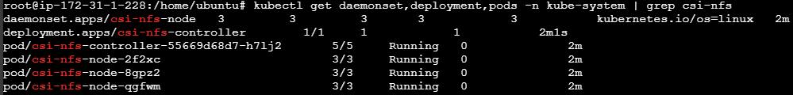

# Dynamic Volume Provisioning

- Dynamic volume provisioning allows storage volumes to be created on-demand.
- Without dynamic provisioning, we have to manually create new storage volumes, and create.

PersistentVolume objects to represent them in Kubernetes.

- The dynamic provisioning feature eliminates the need to pre-provision storage.
- Automatically provisions storage when we create PersistentVolumeClaim objects.
The implementation of dynamic volume provisioning is based on the API object StorageClass from the API group storage.k8s.io.

## StorageClass

- A StorageClass defines how storage is dynamically provisioned.
- Volume plugin (aka provisioner) that provisions a volume.
- Set of parameters to pass to that provisioner when provisioning.

A cluster administrator can define and expose multiple flavors of storage within a cluster, from the same or different storage systems, each with a custom set of parameters.
`it’s like a model that we can later specify the size and colour (classes and objects)`

```yaml
apiVersion: storage.k8s.io/v1
kind: StorageClass
metadata:
  name: fast
provisioner: kubernetes.io/gce-pd
reclaimPolicy: Delete
allowVolumeExpansion: true
parameters:
  type: pd-ssd
```

```yaml
apiVersion: storage.k8s.io/v1
kind: StorageClass
metadata:
  name: low-latency
  annotations:
    storageclass.kubernetes.io/is-default-class: "false" # to make this SC default
provisioner: csi-driver.example-vendor.example # nfs.csi.aws.com
reclaimPolicy: Retain # default value is Delete (What happens after PVC deletion)
allowVolumeExpansion: true
mountOptions:
  - discard # this might enable UNMAP / TRIM at the block storage layer
volumeBindingMode: WaitForFirstConsumer # default value is Immediate
parameters:
  guaranteedReadWriteLatency: "true" # provider-specific
```

If you set the `storageclass.kubernetes.io/is-default-class` annotation to `true` on more than one StorageClass in your cluster, and you then create a PersistentVolumeClaim with no storageClassName set, Kubernetes uses the most recently created default StorageClass.

> [!NOTE]
> Try to have only one default StorageClass in your cluster. Multiple default StorageClasses is to allow for seamless migration.

If you create a PersistentVolumeClaim without specifying a storageClassName, even when no default StorageClass exists. the new PVC creates as you defined it, and the storageClassName remains unset until a default becomes available.

when a default StorageClass becomes available, the control plane identifies existing PVCs without storageClassName. (empty value for storageClassName or do not have this key) the control plane then updates those PVCs to the new default StorageClass.
If you have an existing PVC where the storageClassName is "", and you configure a default StorageClass, then this PVC will not get updated.

## Provisioner

Each StorageClass has a provisioner that determines what volume plugin is used for provisioning PVs.

| Volume Plugin | Internal Provisioner | Config Example |
| --- | --- | --- |
| AzureFile | ✓ | Azure File |
| CephFS | - | - |
| FC | - | - |
| FlexVolume | - | - |
| iSCSI | - | - |
| Local | - | Local |
| NFS | - | NFS |
| PortworxVolume | ✓ | Portworx Volume |
| RBD | - | Ceph RBD |
| VsphereVolume | ✓ | vSphere |

### Real-world Examples

AWS → EBS CSI
Azure → Disk CSI
On-prem → NFS / Ceph

## PVC

```yaml
apiVersion: v1
kind: PersistentVolumeClaim
metadata:
  name: claim1
spec:
  accessModes:
    - ReadWriteOnce
  storageClassName: fast
  resources:
    requests:
      storage: 30Gi
```

## NFS server configuration

Network File System is a shared storage across nodes

```sh
# Install NFS Server
sudo apt update
sudo apt install nfs-kernel-server -y

# Create Shared Directory
sudo mkdir -p /mnt/nfs
sudo chown nobody:nogroup /mnt/nfs
sudo chmod 777 /mnt/nfs

# Configure Export
sudo nano /etc/exports
# Add - /mnt/nfs *(rw,sync,no_subtree_check)
# for Single IP: /mnt/nfs 192.168.1.10(rw,sync,no_subtree_check)
# Example Subnet: /mnt/nfs 192.168.1.0/24(rw,sync,no_subtree_check)

# Apply configuration
sudo exportfs -a
sudo systemctl restart nfs-kernel-server

# Verify
sudo systemctl status nfs-kernel-server
```

### NFS Client Configuration

To enable NFS support on a client system, enter the following command at the terminal prompt:

```sh
sudo apt install nfs-common
```

Kubernetes StorageClass for NFS

```yaml
apiVersion: storage.k8s.io/v1
kind: StorageClass
metadata:
  name: nfs-sc
  namespace: default
provisioner: example.com/external-nfs # nfs.csi.k8s.io
parameters:
  server: <nfs-server-ip>
  path: /mnt/nfs
reclaimPolicy:  Delete
volumeBindingMode:  Immediate
```

> [!NOTE]
> Kubernetes does NOT provide internal NFS provisioner
> Must use NFS CSI driver OR External provisioner

## Real-Time Implementation

### 1. Create StorageClass

```yaml
apiVersion: storage.k8s.io/v1
kind: StorageClass
metadata:
  name: standard
provisioner: ebs.csi.aws.com
volumeBindingMode: WaitForFirstConsumer
```

### 2. Create PVC

```yaml
apiVersion: v1
kind: PersistentVolumeClaim
metadata:
  name: app-pvc
spec:
  accessModes:
    - ReadWriteOnce
  storageClassName: standard
  resources:
    requests:
      storage: 10Gi
```

### 3. Use in Deployment

```yaml
volumes:
  - name: app-storage
    persistentVolumeClaim:
      claimName: app-pvc
```

`PVC created` → `StorageClass identified` → `Provisioner called` → `PV created dynamically` → `PV bound to PVC` → `Pod uses volume`

```sh
curl -skSL https://raw.githubusercontent.com/kubernetes-csi/csi-driver-nfs/master/deploy/install-driver.sh | bash -s master --
```


